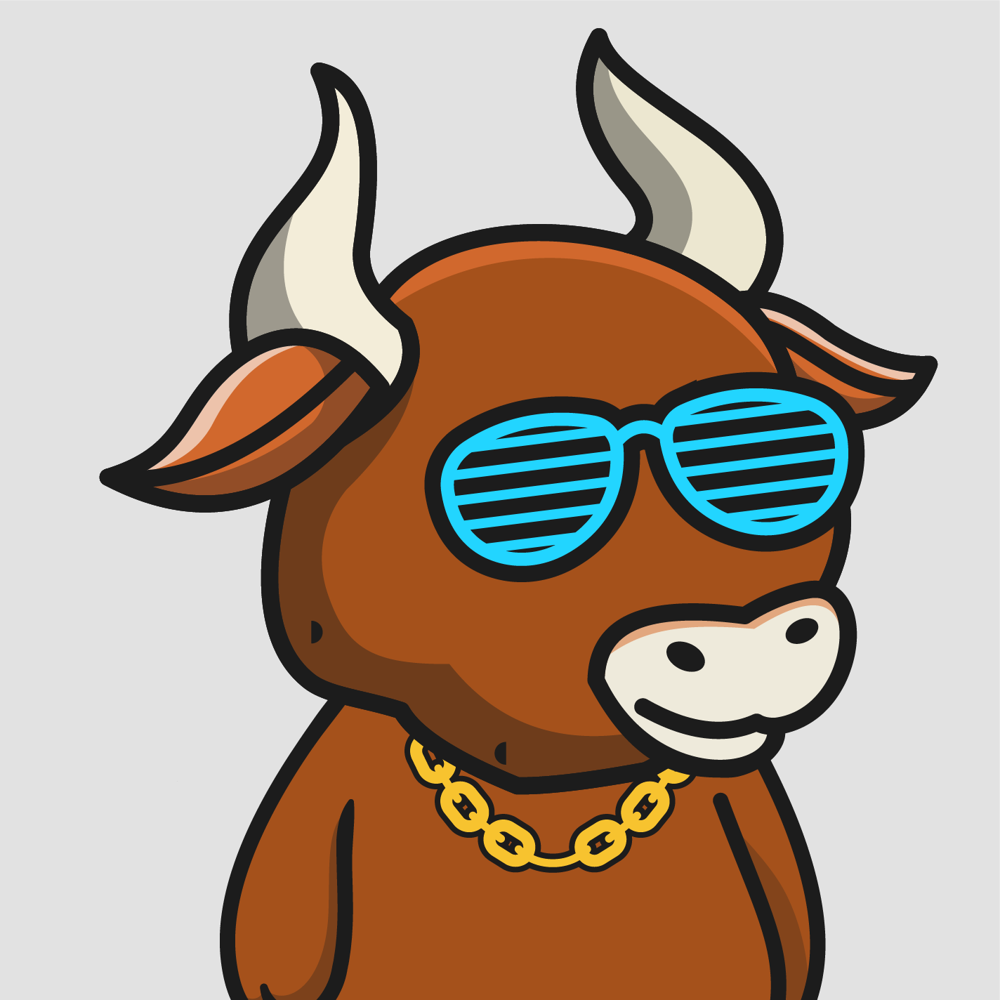

# REPOSITORY FOR THE CHAINLINK LABS MODULE IN ALCHEMY'S ROAD TO WEB3 DEVELOPER PROGRAM

### TABLE OF CONTENTS

- [Project Description](#project-description)
- [Expanding Your Skills](#expanding-your-skills)
- [Tooling Requirements](#tooling-requirements)
- [Branches](#branches)
- [Assignment](#assignment)
- [Viewing NFTS](#viewing-nfts-on-opensea)

### Project Description

<a href="https://www.youtube.com/watch?v=hNdXSMKLDi4&ab_channel=Alchemy">Tutorial on youtube</a>
<a href="https://docs.alchemy.com/alchemy/road-to-web3/weekly-learning-challenges/5.-connect-apis-to-your-smart-contracts-using-chainlink">Written tutorial version</a>

This project mints Dynamic NFTs that change based on the market price of an asset pair (for example, the BTC/USD asset price). When prices go up, its a bull trend and when the go down its a bear trend. We run [Chainlink Keepers](https://docs.chain.link/docs/chainlink-keepers/introduction/) to have our smart contract automatically called at specified intervals so that on-chain logic checks the [Chainlink Price Feed](https://docs.chain.link/docs/using-chainlink-reference-contracts/) to see if there has been a change in price. Accordingly the minted NFTs dynamically alternate between the images below.

    
    
    
    
    
    

